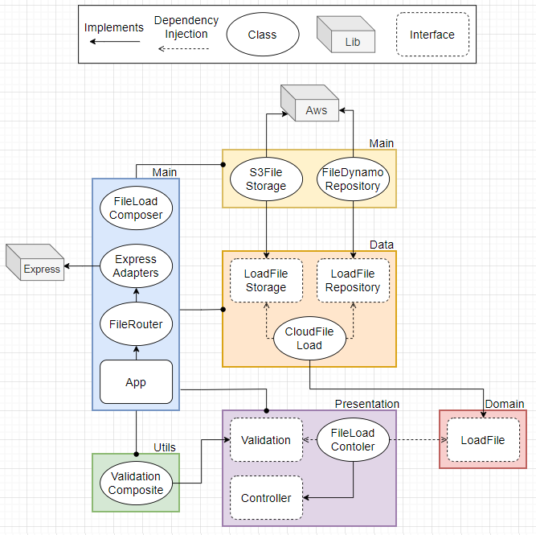

# File Load

> ## Success Case

1. ✅ Receive a request of type **GET** on rote **/api/load**
2. ✅ Authenticate **accessToken** if is valid
3. ✅ Validate required data **id** and **bucket**
4. ✅ **Load** file informations from database with the provided data 
5. ✅ **Load** file from cloud storage with file informations acquired 
6. ✅ Return **200** with the file

> ## Exceptions

1. ✅ Returns an error **404** if the API dont exist
2. ✅ Returns an error **400** if id or bucket are not provided
3. ✅ Returns an error **404** if the file is not found with provided data
4. ✅ Returns an error **500** if an error accours when is tried load file informations from database
5. ✅ Returns an error **500** if an error accours when is tried load the file from cloud storage

> ## Diagram

