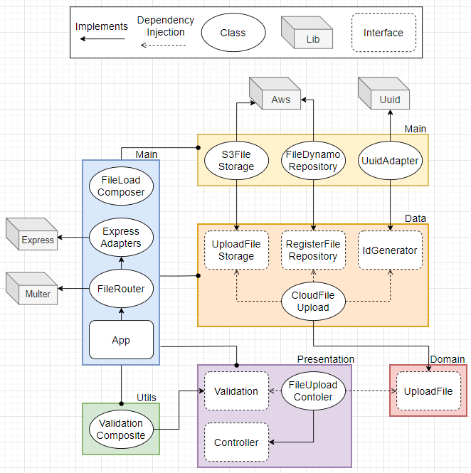

# File Upload

> ## Success Case

1. ✅ Receive a request of type **POST** on rote **/api/upload**
2. ✅ Authenticate **accessToken** if is valid
3. ✅ Validate required data **bucket** and **file**
4. ✅ Generate a **uuid**
5. ✅ **Upload** file to the cloud storage 
6. ✅ **Register** file informations on database 
7. ✅ Return **200** with an success message

> ## Exceptions

1. ✅ Returns an error **404** if the API dont exist
2. ✅ Returns an error **400** if bucket or file are not provided
3. ✅ Returns an error **404** if an bucket is not founded with the provided data
4. ✅ Returns an error **500** if an error accours when is tried to generate an uuid
5. ✅ Returns an error **500** if an error accours when is tried upload the file to the cloud storage
6. ✅ Returns an error **500** if an error accours when is tried register file informations on database

> ## Diagram

